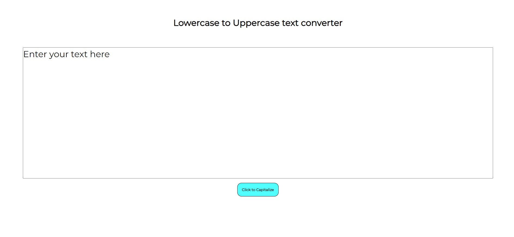

# simple-text-capitalizer-react-js

## A simple react app that converts lowercase text to uppercase text.

- __How to use:__
  - Clone it in a folder using the git clone command.
  - Open a new terminal using the same folder as the current directory and type "npm i" to install all dependencies. Once that is done run "npm start" to start the developmental server on your machine.
  - Open a browser window and type localhost:3000 in the address bar.
  - Once you are done you should see this on your browser
  - 
    
   
